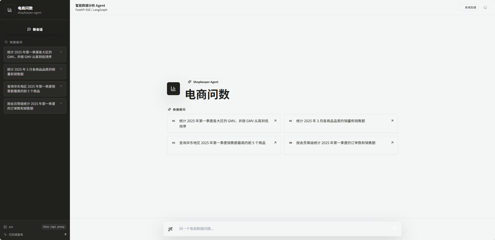
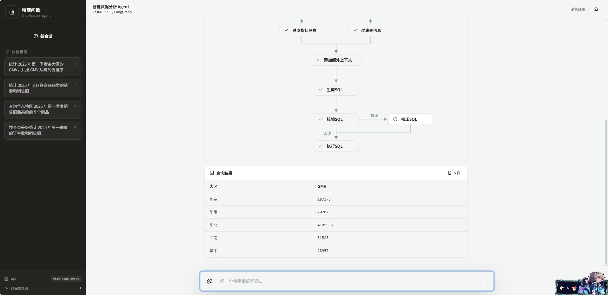

<div align="center">

# 电商问数智能数据分析 Agent

### 基于 LangGraph + Hybrid RAG + Text-to-SQL 的企业智能问数系统

<p>
面向企业数据分析场景，构建从
<strong>元数据知识库 → Hybrid RAG → Agent 推理 → SQL 生成 → SQL 校验修正 → 数据库执行 → SSE 流式返回</strong>
的完整智能问数闭环。


# 1. 项目背景

企业内部的数据分析通常依赖数据分析人员编写 SQL，业务人员虽然熟悉业务，却往往不了解数据库 Schema、字段名称和指标计算口径。

传统的：

```text
自然语言
   ↓
LLM
   ↓
SQL
```

在真实企业数据场景中容易出现：

* 表选择错误
* 字段选择错误
* 指标口径理解错误
* 用户业务值无法准确映射
* SQL 语法错误
* SQL 可以执行但语义错误
* 数据库 Schema 过大导致 Prompt 上下文冗余

因此，本项目围绕 **“如何让 LLM 在企业真实数据环境中更加可靠地完成自然语言问数”** 进行设计。

核心思路不是让 LLM 直接猜 SQL，而是：

```text
自然语言问题
      ↓
检索与问题相关的企业元数据
      ↓
构建精准上下文
      ↓
LLM 生成 SQL
      ↓
数据库校验
      ↓
错误自动反馈与 SQL 修正
      ↓
执行并返回结果
```

---

# 2. 项目核心亮点

## ⭐ 亮点一：面向问数场景设计 Hybrid RAG

没有采用单一 Vector RAG，而是针对企业数据中的不同信息类型设计不同检索方式：

```text
                 用户问题
                    │
          ┌─────────┼─────────┐
          ↓         ↓         ↓
        字段       指标      字段真实值
          ↓         ↓         ↓
       Qdrant     Qdrant   Elasticsearch
          └─────────┼─────────┘
                    ↓
                结果融合
                    ↓
               上下文构建
```

其中：

* **Qdrant**：负责字段、指标语义召回；
* **Elasticsearch**：负责城市、地区、品牌、商品等真实业务值的关键词检索；
* **MySQL**：保存权威结构化元数据。

解决了单一向量检索对于**精确业务值和结构化元数据**处理能力不足的问题。

---

# 3. 项目整体架构

```text
                         用户
                          │
                          ↓
                  ┌──────────────┐
                  │ Natural Query│
                  └──────┬───────┘
                         │
                         ↓
              ┌─────────────────────┐
              │   LangGraph Agent   │
              │                     │
              │  Keyword Extraction │
              │          ↓          │
              │   Multi Retrieval   │
              │          ↓          │
              │   Context Merge     │
              │          ↓          │
              │   Context Filter    │
              │          ↓          │
              │    SQL Generate     │
              │          ↓          │
              │   SQL Validation    │
              │       ↙     ↘       │
              │    Success   Error  │
              │       ↓       ↓     │
              │    Execute   Repair │
              │                │    │
              │                └───→│
              └──────────┬──────────┘
                         │
                         ↓
                  Query Result
                         │
                         ↓
                    SSE Stream
                         │
                         ↓
                    React UI
```

底层基础设施：

```text
        ┌──────────────┐
        │    MySQL     │
        │ Data + Meta  │
        └──────────────┘

        ┌──────────────┐
        │    Qdrant    │
        │ Vector Search│
        └──────────────┘

        ┌──────────────┐
        │Elasticsearch │
        │Full-text     │
        └──────────────┘

        ┌──────────────┐
        │     TEI      │
        │  Embedding   │
        └──────────────┘
```

---

# 4. 核心技术一：企业元数据知识库

## 4.1 为什么不能直接把数据库 Schema 全部给 LLM？

如果数据库中存在大量：

```text
表
字段
字段描述
指标
业务枚举值
```

直接全部放入 Prompt 会导致：

1. Context 过长；
2. 无关字段干扰模型；
3. Token 成本增加；
4. 模型选择错误字段；
5. SQL 生成准确率下降。

因此项目首先建立独立的**元数据知识库**。

---

## 4.2 元数据分层存储

```text
                    元数据
                       │
        ┌──────────────┼──────────────┐
        ↓              ↓              ↓
      MySQL          Qdrant       Elasticsearch
        │              │              │
  结构化元数据      语义检索        字段值检索
        │              │              │
  Table / Column    Column Vector   Province
  Metric / Relation Metric Vector   City
                                    Brand
                                    Product
```

### MySQL

保存权威结构化信息：

```text
Table
Column
Metric
Metric-Column Relation
Column Description
```

### Qdrant

将：

```text
字段名称 + 字段描述
指标名称 + 指标口径
```

转换为 Embedding，支持语义召回。

### Elasticsearch

针对：

```text
城市
地区
品牌
商品
门店
分类
```

等真实业务值建立全文索引。

---

# 5. 核心技术二：Hybrid RAG 多路召回

项目将问数问题拆分为不同信息需求。

例如：

> 统计华北地区最近一个月的销售总额

系统需要找到：

```text
指标：
销售总额

条件字段：
地区
时间

字段值：
华北

时间范围：
最近一个月
```

因此设计：

```text
                 Query
                   │
             Keyword Extract
                   │
      ┌────────────┼────────────┐
      ↓            ↓            ↓
  Column Search Metric Search Value Search
      ↓            ↓            ↓
   Qdrant        Qdrant      Elasticsearch
      └────────────┼────────────┘
                   ↓
             Retrieval Merge
                   ↓
          Dependency Completion
                   ↓
             Context Filter
```

这样做的核心价值是：

> **不同类型的数据使用不同检索方式，而不是让一个 Vector Search 解决所有问题。**

---

# 6. 核心技术三：LangGraph Agent 工作流

项目没有采用简单的：

```python
llm.invoke(prompt)
```

而是使用 LangGraph 将问数过程拆分成多个具有明确职责的节点。

核心 State 包括：

```text
query
keywords
retrieved_columns
retrieved_metrics
retrieved_values
context
sql
sql_error
query_result
```

工作流：

```text
START
  │
  ↓
Keyword Extraction
  │
  ├──── Column Retrieval
  ├──── Metric Retrieval
  └──── Value Retrieval
          │
          ↓
    Merge Retrievals
          │
          ↓
    Extra Context
          │
          ↓
    Context Filtering
          │
          ↓
      SQL Generate
          │
          ↓
     SQL Validate
       ↙       ↘
    Success    Error
      ↓          ↓
   Execute    SQL Repair
      │          │
      │          └────→ SQL Validate
      ↓
     END
```

通过 LangGraph 的：

* State
* Node
* Edge
* Conditional Edge
* Loop

实现具有状态管理和条件分支能力的 Agent Workflow。

---

# 7. 核心技术四：SQL 生成与自动修正闭环

这是整个项目中比较重要的工程闭环之一。

传统 Text-to-SQL：

```text
Question
   ↓
LLM
   ↓
SQL
   ↓
返回
```

本项目采用：

```text
Question
   ↓
Retrieval
   ↓
Context
   ↓
SQL Generate
   ↓
SQL Validate
   ↓
┌───────────────┐
│               │
成功            失败
│               │
↓               ↓
Execute      Error Feedback
│               ↓
│            SQL Repair
│               ↓
│          SQL Validation
│               │
└───────────────┘
```

当数据库返回：

```text
Unknown column xxx
```

或者：

```text
Table xxx doesn't exist
```

Agent 会将错误信息重新加入上下文：

```text
Original Context
+
Generated SQL
+
Database Error
        ↓
      LLM
        ↓
Corrected SQL
```

然后重新执行校验。

因此 SQL Agent 形成：

> **Generate → Validate → Repair → Execute**

的闭环。

---

# 8. 核心技术五：区分“精确查询”和“语义查询”

企业问数中并不是所有数据都适合向量检索。

例如：

### 语义查询

```text
用户：
“销售总额是多少？”

适合：
Vector Search

匹配：
销售金额
销售收入
销售总额
GMV
```

### 精确值查询

```text
用户：
“查询华北地区销售额”

适合：
Keyword / Full-text Search

匹配：
华北
```

因此项目采用：

```text
语义信息
   ↓
Qdrant

精确业务值
   ↓
Elasticsearch

权威结构化信息
   ↓
MySQL
```

这种设计也避免了：

> **把所有信息都强行向量化。**

---

# 9. 核心技术六：上下文过滤与补全

检索并不是结束。

如果直接把 Top-K 全部结果交给 LLM，也可能产生：

```text
Context
   ↓
大量无关字段
   ↓
LLM 注意力分散
   ↓
SQL 选择错误
```

因此在 SQL 生成之前增加：

```text
Retrieval
    ↓
Merge
    ↓
Dependency Completion
    ↓
Column Filtering
    ↓
Metric Filtering
    ↓
Date Context
    ↓
Database Context
    ↓
Final SQL Context
```

最终只向 LLM 提供与当前问题相关的信息。

---

# 10. 核心技术七：FastAPI + SSE 流式 Agent

后端采用 FastAPI。

接口：

```text
POST /api/query
```

用户发送：

```json
{
  "query": "统计华北地区的销售总额"
}
```

后端不是等整个 Agent 执行结束后一次性返回，而是通过 SSE 实时返回：

```text
progress
  ↓
关键词提取完成

progress
  ↓
字段召回完成

progress
  ↓
指标召回完成

progress
  ↓
字段值召回完成

progress
  ↓
SQL 生成完成

progress
  ↓
SQL 校验完成

result
  ↓
查询结果
```

前端可以实时展示 Agent 当前执行阶段。

---

# 11. 核心技术八：工程化分层

项目没有把所有逻辑写在 Agent Node 中，而是进行分层：

```text
app/
├── agent/
│   └── LangGraph Workflow
│
├── services/
│   └── Business Logic
│
├── repositories/
│   └── Data Access
│
├── clients/
│   └── MySQL / Qdrant / ES / Embedding
│
├── models/
│   └── SQLAlchemy ORM
│
├── entities/
│   └── Business Entity
│
├── api/
│   └── FastAPI
│
└── core/
    └── Logging / Context
```

核心职责：

```text
API
 ↓
Service
 ↓
Agent
 ↓
Repository
 ↓
Database / Vector DB / ES
```

避免 Agent、数据库访问、API 和业务逻辑高度耦合。

---

# 12. 日志与请求追踪

为了方便定位 Agent 问题，为每个请求生成：

```text
request_id
```

通过 `ContextVar` 将 request_id 注入当前请求上下文。

例如：

```text
request_id=8a7f...
    ↓
API
    ↓
Agent
    ↓
Retrieval
    ↓
SQL Generate
    ↓
SQL Execute
```

出现问题时可以根据 request_id 定位一次完整请求。

---

# 13. 一次完整请求示例

用户：

> **统计华北地区最近一个月的销售总额**

Agent 内部：

```text
① Query Understanding

地区 → 华北
时间 → 最近一个月
指标 → 销售总额

        ↓

② Column Retrieval

地区字段
销售金额字段
日期字段

        ↓

③ Metric Retrieval

销售总额

        ↓

④ Value Retrieval

华北

        ↓

⑤ Context Construction

Table
Column
Metric
Value
Date Context

        ↓

⑥ SQL Generation

SELECT
    SUM(sales_amount)
FROM ...
WHERE region = '华北'
AND ...

        ↓

⑦ SQL Validation

EXPLAIN / Execute

        ↓

⑧ SQL Repair

如果失败：
Error → LLM → Correct SQL

        ↓

⑨ Execute

        ↓

⑩ SSE

返回查询结果
```

---

# 14. 项目技术难点

| 技术难点               | 解决方案                        |
| ------------------ | --------------------------- |
| LLM 不理解企业 Schema   | 建立独立元数据知识库                  |
| 字段名称与用户表达不一致       | Qdrant 语义检索                 |
| 城市、地区等业务值召回困难      | Elasticsearch 全文检索          |
| 单一 Vector RAG 能力有限 | 字段 + 指标 + 字段值 Hybrid RAG    |
| Retrieval 结果存在大量噪声 | Context Filter              |
| 字段存在依赖关系           | Dependency Completion       |
| LLM SQL 语法错误       | SQL Validation              |
| SQL 执行失败           | Error Feedback + SQL Repair |
| Agent 多步骤状态复杂      | LangGraph State             |
| Agent 执行过程不可见      | SSE Streaming               |
| 多请求日志难定位           | ContextVar + request_id     |
| 多个基础设施依赖           | Docker Compose              |

---

# 15. 项目工程能力

这个项目覆盖了一个完整 AI 应用从数据到服务的链路：

```text
┌────────────────────────────────────────────┐
│                 AI Application             │
├────────────────────────────────────────────┤
│                                            │
│  Data Layer                                │
│  └── MySQL                                 │
│                                            │
│  Retrieval Layer                           │
│  ├── Qdrant                                │
│  ├── Elasticsearch                         │
│  └── Embedding / TEI                       │
│                                            │
│  Agent Layer                               │
│  ├── LangGraph                             │
│  ├── State Management                      │
│  ├── Conditional Routing                   │
│  └── SQL Repair Loop                       │
│                                            │
│  Service Layer                              │
│  ├── FastAPI                               │
│  └── SSE                                   │
│                                            │
│  Frontend                                  │
│  └── React                                 │
│                                            │
│  Infrastructure                            │
│  └── Docker Compose                        │
│                                            │
└────────────────────────────────────────────┘
```

---

# 16. 项目效果

目前系统已经实现：

* ✅ 自然语言问数
* ✅ 企业元数据知识库
* ✅ 字段语义检索
* ✅ 指标语义检索
* ✅ 字段真实值检索
* ✅ Hybrid RAG
* ✅ LangGraph Agent
* ✅ 多阶段 State 管理
* ✅ Text-to-SQL
* ✅ SQL 校验
* ✅ SQL 自动修正
* ✅ 数据库真实执行
* ✅ FastAPI API
* ✅ SSE 流式输出
* ✅ React 前端
* ✅ Docker Compose 环境
* ✅ request_id 请求追踪

---

# 17. 技术栈

| 分类                | 技术                      |
| ----------------- | ----------------------- |
| 编程语言              | Python                  |
| Agent             | LangGraph               |
| LLM Framework     | LangChain               |
| LLM               | OpenAI-Compatible API   |
| Embedding         | BAAI/bge-large-zh-v1.5  |
| Embedding Serving | TEI                     |
| Vector DB         | Qdrant                  |
| Full-text Search  | Elasticsearch           |
| Relational DB     | MySQL                   |
| ORM               | SQLAlchemy              |
| Backend           | FastAPI                 |
| Streaming         | SSE                     |
| Frontend          | React + Vite + Tailwind |
| Container         | Docker / Docker Compose |
| Dependency        | uv / pnpm               |
| Logging           | loguru + ContextVar     |

---

# 18. 项目结构

```text
shopkeeper-agent/
│
├── app/
│   ├── agent/              # LangGraph Agent Workflow
│   ├── api/                # FastAPI API
│   ├── clients/            # 基础设施客户端
│   ├── conf/               # 配置管理
│   ├── core/               # 日志、request_id
│   ├── entities/           # 业务实体
│   ├── models/             # SQLAlchemy ORM
│   ├── prompt/             # Prompt
│   ├── repositories/       # 数据访问层
│   ├── scripts/            # 知识库构建
│   └── services/           # 业务服务
│
├── conf/
├── docker/
├── frontend/
├── prompts/
├── main.py
└── pyproject.toml
```

---

# 19. 快速运行

## 环境

```text
Python >= 3.14
Docker
Docker Compose
Node.js
pnpm
uv
```

## 安装

```bash
git clone https://github.com/hrbust-lwb/shopkeeper-agent.git

cd shopkeeper-agent

uv sync
```

## 配置 LLM 与 Langfuse

```bash
cp .env.example .env
```

填写：

```env
LLM_API_KEY=your_api_key
LANGFUSE_PUBLIC_KEY=your_langfuse_public_key
LANGFUSE_SECRET_KEY=your_langfuse_secret_key
LANGFUSE_BASE_URL=https://cloud.langfuse.com
LANGFUSE_TRACING_ENABLED=true
```

每次 `POST /api/query` 会创建一个 Langfuse trace，并自动记录 LangGraph
根流程、12 个业务节点以及节点内 LLM 调用的嵌套执行关系。

---

## 启动基础设施

```bash
docker compose -f docker/docker-compose.yaml up -d
```

服务：

```text
MySQL             3306
Elasticsearch     9200
Kibana             5601
Qdrant             6333
Embedding          8081
```

---

## 构建元数据知识库

```bash
uv run python \
  -m app.scripts.build_meta_knowledge \
  -c conf/meta_config.yaml
```

---

## 启动后端

```bash
uv run fastapi dev main.py
```

API：

```text
POST /api/query
```

---

## 启动前端

```bash
cd frontend

pnpm install

pnpm dev
```

访问：

```text
http://localhost:5173
```

---

# 20. 项目演示

### 首页



### Agent 执行与查询结果



### 系统架构


---

# 21. 后续优化方向

后续计划继续围绕企业级 AI Agent 能力进行扩展：

### RAG

* [ ] Query Rewrite
* [ ] Rerank
* [ ] Hybrid Search 权重优化
* [ ] Retrieval Evaluation
* [ ] Badcase 自动采集

### Agent

* [ ] 多轮问数
* [ ] Query 改写
* [ ] 会话记忆
* [ ] 复杂分析任务拆解
* [ ] Reflection / Replan
* [ ] 自动生成分析结论

### 数据安全

* [ ] RBAC
* [ ] 数据权限
* [ ] 行列级权限
* [ ] SQL 白名单
* [ ] SQL Audit
* [ ] 敏感字段脱敏

### 工程化

* [x] LangFuse 全链路追踪
* [ ] Prometheus + Grafana
* [ ] 自动化评测
* [ ] Redis Cache
* [ ] 限流与并发控制
* [ ] 生产环境部署

